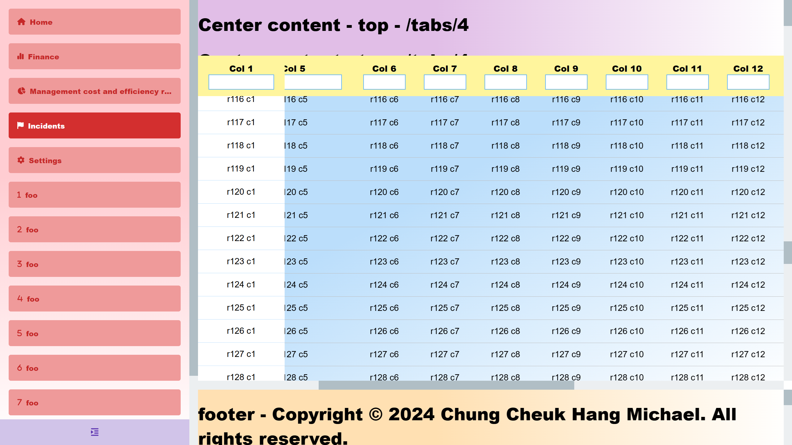
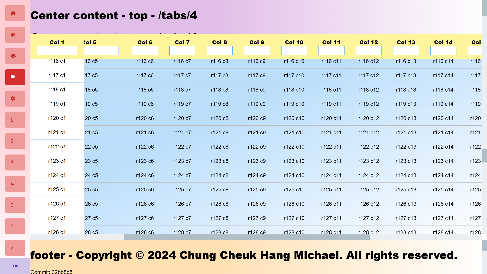
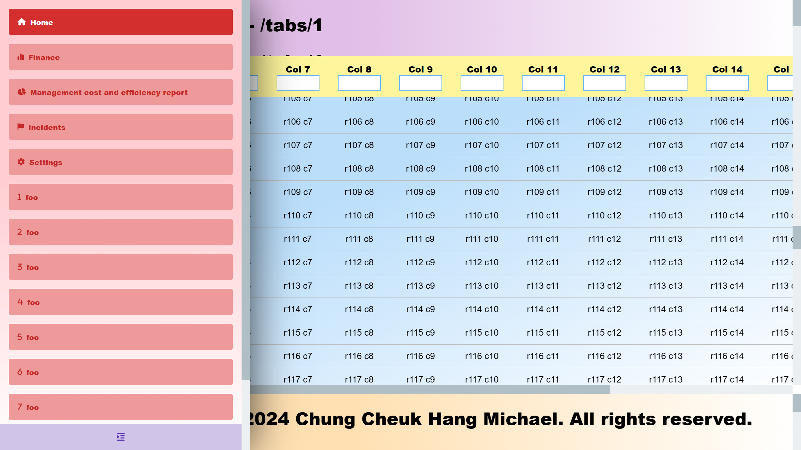
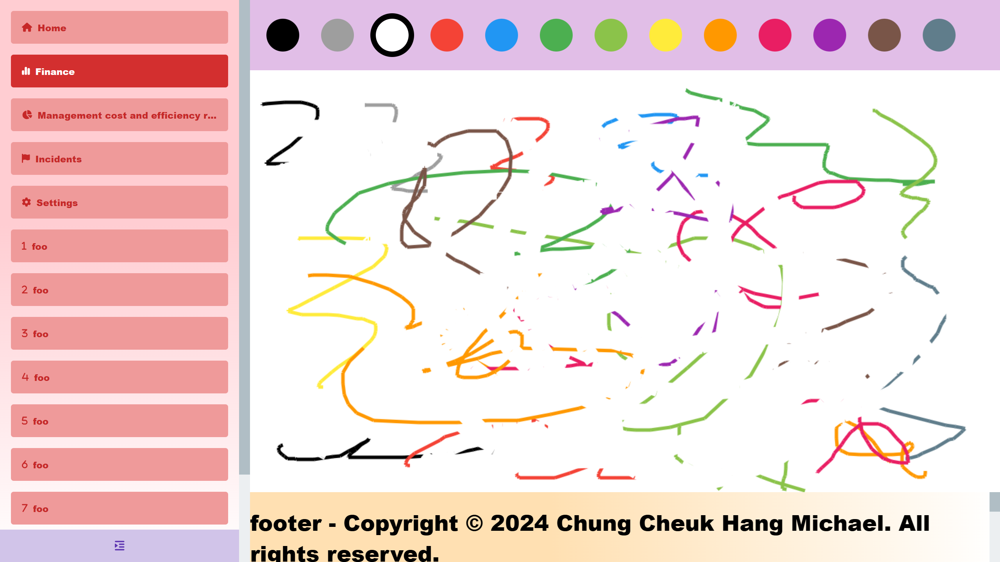
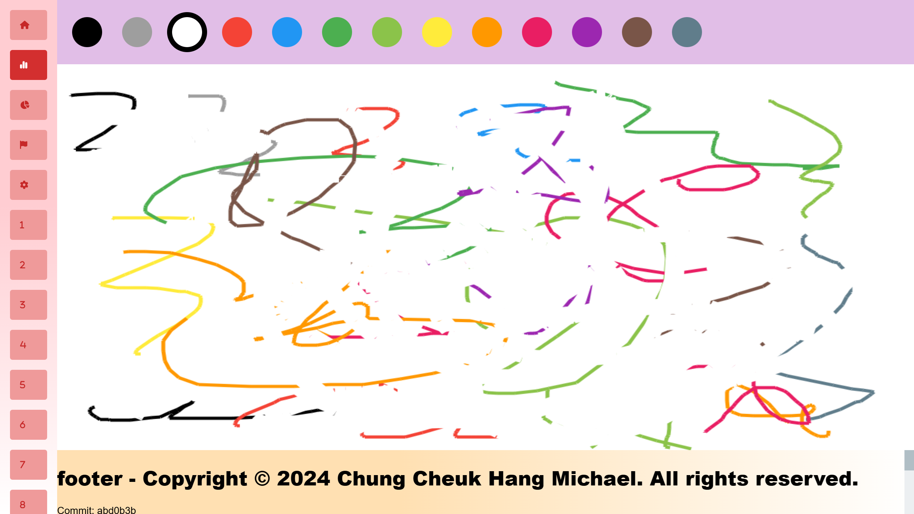
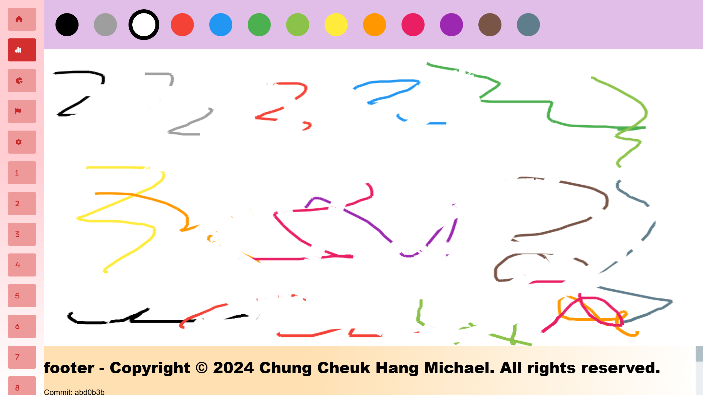

The Demo React Layout project in this Git repository is developed and maintained by Chung Cheuk Hang Michael.

[Visit the deployed GitHub Pages for the result.](https://blackr1234.github.io/demo-react-layout/)

---

# Overview

This website is responsive. It works great on both desktop and mobile web browsers.

---

# Nav bar

Expanded (default):

Collapsed:

Hovered:

---

# Paint

Drawings:

Resize canvas:

Multiple undos (Ctrl + Z):

---

Copyright © 2024 Chung Cheuk Hang Michael. All rights reserved.
